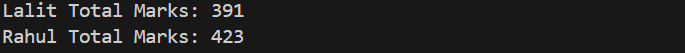
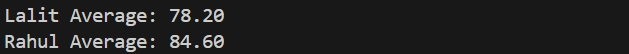
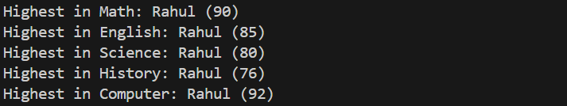
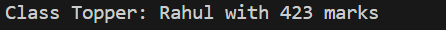
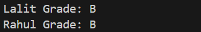

# Student Performance Analyzer

## 1. Total Marks Calculation

Explanation:
- This output shows total marks calculated for each student.

---

## 2. Average Marks Calculation

Explanation:
- Displays average marks per student.

---

## 3. Subject-wise Highest Score

Explanation:
- Shows highest scorer in each subject.

---

## 4. Class Topper

Explanation:
- Identifies student with highest total marks.

---

## 5. Grade & Fail Conditions

Explanation:
- Displays grades and fail conditions based on rules.